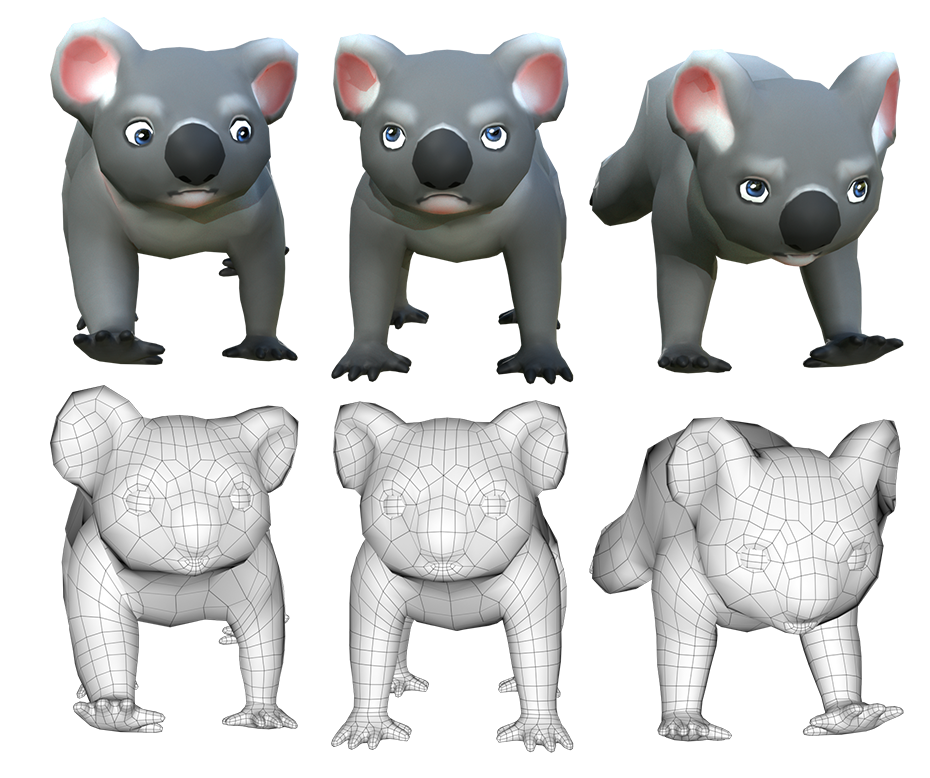

# 3D and Game Portfolio

[This](https://lucyogdendoyle.com/) is my portfolio showcasing some of my 3D art and VR/AR Games that I have made from 2017-2019.

## Technologies

- I worked on VR and AR Games in the Unity engine, using C#.
  - Implementing UI systems
  - AR Tracking
  - Animations
  - Interaction with user via touch, or controller
  - Login and saving systems

> DownUndar. I was responsible for UI and AR functionality. Implemented in Unity.

> Cadbury Elfie Selfie app. I was responsible for UI and facial tracking, as well as modelling the elves. Implemented in Unity.

- 3D Sculpting in Zbrush to create organic shapes
- 3D Modelling in Maya to create game ready models, as well as hard-surface modelling.
- Painting 3D models in Substance Painter to give them colour and texture.

> Lion Model. I was responsible for model. Sculpted in Zbrush and Painted in Substance Painter.

> Game Ready Koala model. I was responsible for modelling and texturing.

> Personal experimentation with sculpting. I was responsible for all. Sculpting and painting in Zbrush, hair and rendering in Maya.
